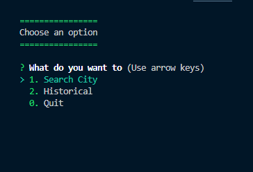
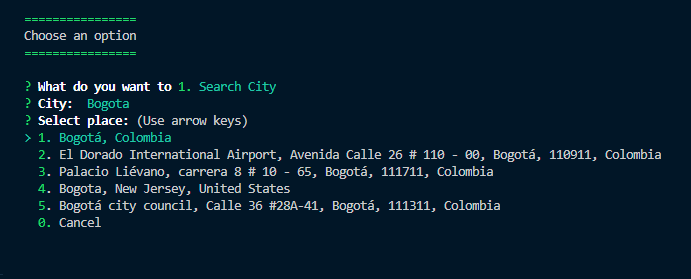
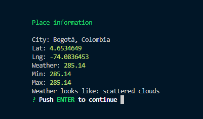
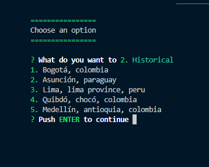

# Weather Cities App

This app was created to calculate the weather of a city that you search by its name.

## How can I use this application?

1. You must to create an account in mapbox.com to create an API Key and then set its api_key into respective enviroment variable.

2. You must to create an account in openweathermap.org to create an API Key and then set its api_key into respective enviroment variable.

3. Create a ".env" file and set both API keys.

4. Execute de command __npm i__ to install all dependencies.

5. Execute de command __npm start__ to execute de application.

## Graphic description of the project

Thanks for read this information. If you want to comment any observation about this code, I'll hear you.

